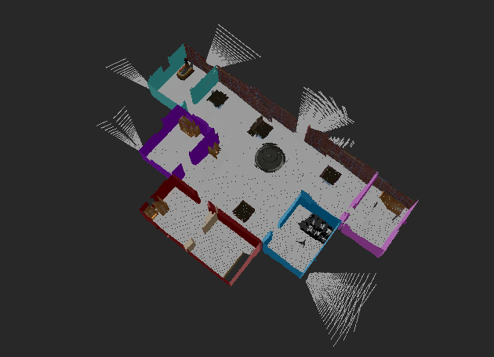

# MapMyWorld

  

## Overview

This project is the fourth project in Udacity Robotics Software Engineer nano degree where the world was mapped using [rtabmap] which produces both 2D-maps and 3D-maps also can be used for navigation. In addition, [joy] package was used to move the rbot during the mapping process and it can also be replaced by [teleop_twist_keyboard].

**Keywords:** ROS, rtabmap, 3D-map, mapping, navigation, SLAM.

**Author: Mennatallah Aly **

The MapMyWorld package has been tested under [ROS] Melodic on Ubuntu 18.04. and Gazebo 9.0.0

## Installation

### Installation from Packages

To install all packages from the this repository as Debian packages use

    sudo apt-get update && sudo apt-get upgrade -y
    sudo apt-get install ros-melodic-navigation
    sudo apt-get install ros-melodic-map-server
    sudo apt-get install ros-melodic-move-base
    sudo apt install ros-melodic-rtabmap-ros
    sudo apt install ros-melodic-rtabmap
    
To navigate with keyboard 

	sudo apt-get install ros-melodic-teleop-twist-keyboard
	
To navigate with joystick

	sudo apt-get install ros-melodic-joy ros-melodic-joystick-drivers

    
Or better, use `rosdep`:

	sudo rosdep install --from-paths src

## Building from Source

To build from source, clone the latest version from this repository into your catkin workspace and compile the package using

	cd catkin_ws/src
	sudo apt update
	git clone https://github.com/Mennatallah98/MapMyWorld.git
	cd ../
	rosdep install --from-paths . --ignore-src
	catkin_make
	
Source the workspace by adding this line .bashrc

	source ~/catkin_ws/devel/setup.bash

## Usage

In a new terminal

Open the world the world in gazebo and rviz with the rbot included

	roslaunch my_robot world.launch

### Mapping

In another window

Run navigation stack with the modified configuration file

	roslaunch my_robot amcl.launch

### Navigation

create yaml file simlar to that exsitant in the repistory with measurements based on your world

## Config files

Config file folder/config

* **base_local_planner_params.yaml:** contains the parameters for [base_local_planner] which is  responsible for computing velocity commands to send to the mobile base. 

* **costmap_common_params.yaml:** contains the [common] parameters between the global and local [costmap].

* **global_costmap_params.yaml:** contains the parameters for [global] [costmap].

* **local_costmap_params.yaml:** contains the parameters for [local] [costmap].

## Launch files

* **robot_description.launch:** Runs the robot file and starts the joint publisher robot state publisher.

* **world.launch:** Starts rviz customized configuration and gazebo with the customized world , spawns the robot and launches robot_description.

* **amcl.launch:** Runs amcl, move_base, and map_server and sets the initial position of the robot in the map.

## Packages

* **my_robot:** Contains the URDF of r 4-wheeled under the name of my_robot with the attached sensors in addition to the world with robot embbeded in aldo the modified configuartion files and the world map.

* **[pgm_map_creator]:** Draws a map for the Gazebo world.

## Structure

    └── MapMyWorld                                      # Map My World Project
        └── my_robot
            ├── CMakeLists.txt                          # compiler instructions
            ├── config                                  # config folder for configuration files 
            │   ├── base_local_planner_params.yaml
            │   ├── costmap_common_params.yaml
            │   ├── global_costmap_params.yaml
            │   ├── local_costmap_params.yaml
            │   └── __MACOSX
            ├── db                                      # db folder for rtabmap database
            │   └── rtabmap.db
            ├── launch                                  # launch folder for launch file
            │   ├── joy.launch
            │   ├── localization.launch
            │   ├── mapping.launch
            │   ├── robot_description.launch
            │   └── world.launch
            ├── meshes                                  # meshes folder for sensors
            │   └── hokuyo.dae
            ├── package.xml                             # package info
            ├── rviz
            │   └── myworld.rviz
            ├── scripts                                 # scripts folder for python nodes
            │   └── joy_teleop
            ├── urdf                                    # urdf folder for xarco files
            │   ├── my_robot.gazebo
            │   └── my_robot.xacro
            └── worlds                                  # world folder for world files
                └── myworld.world

[ROS]: http://www.ros.org
[joy]: http://wiki.ros.org/joy
[teleop_twist_keyboard]: http://wiki.ros.org/teleop_twist_keyboard
[rtabmap]: http://wiki.ros.org/rtabmap_ros
[navigation_stack]: http://wiki.ros.org/navigation/Tutorials/RobotSetup
[base_local_planner]: http://wiki.ros.org/base_local_planner
[costmap]: http://wiki.ros.org/costmap_2d
[global]: http://wiki.ros.org/navigation/Tutorials/RobotSetup#Global_Configuration:~:text=Global%20Configuration%20(global_costmap)
[local]: http://wiki.ros.org/navigation/Tutorials/RobotSetup#Local_Configuration:~:text=Local%20Configuration%20(local_costmap)
[common]: http://wiki.ros.org/navigation/Tutorials/RobotSetup#Global_Configuration:~:text=Common%20Configuration%20(local_costmap)%20%26%20(global_costmap)
